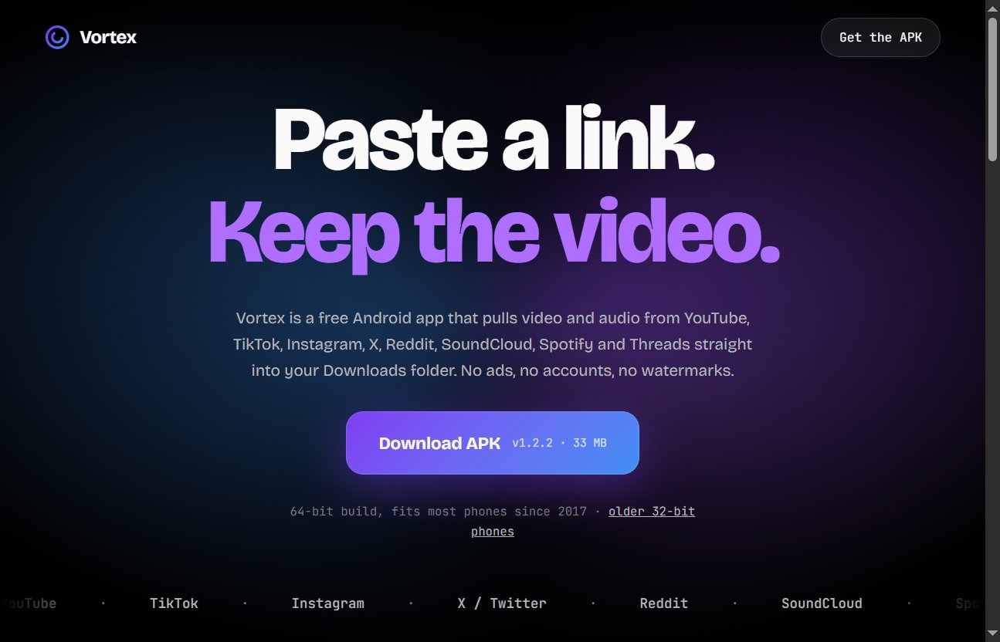

# Vortex

> Paste a link. Keep the video.

---

Free Android app that pulls video and audio from YouTube, TikTok, Instagram, X, Reddit, SoundCloud, Spotify and Threads straight into your Downloads folder. No ads, no accounts, no watermarks.

## Features

- Download video or audio from 7+ platforms
- No login required — no account, no watermark
- 64-bit build, fits every Android phone since 2017
- Simple paste-and-go interface

## Install

[**Download APK v1.2.2 — 33 MB**](https://vortex-site-pi.vercel.app/)

## License

MIT
